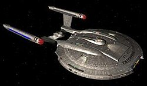

# 🚀 Star Wars Starships Explorer

Bu proje, [Star Wars API (SWAPI)](https://www.swapi.tech/) üzerinden Star Wars evrenindeki uzay gemilerini keşfetmenizi sağlayan bir React uygulamasıdır.

## Özellikler ✨

- ⭐ Star Wars uzay gemilerini listeleme
- 🔍 İsim veya model ile arama ve filtreleme
- 📄 Detay sayfasında gemi bilgilerini görüntüleme
- 🖼️ Görsel destekli kartlar
- 📱 Duyarlı ve modern tasarım

## Kurulum 🛠️

1. Depoyu klonlayın:

2. Bağımlılıkları yükleyin:

   ```sh
   npm install
   ```

3. Geliştirme sunucusunu başlatın:

   ```sh
   npm run dev
   ```

4. Uygulamayı tarayıcıda açın: [http://localhost:5173](http://localhost:5173)

## Proje Yapısı 📁

- `src/pages/Home.jsx` — Ana sayfa, arama ve listeleme
- `src/components/StarshipCard.jsx` — Uzay gemisi kartı
- `src/components/StarshipDetail.jsx` — Detay sayfası
- `src/assets/` — Görseller
- `src/styles.css` — Genel stiller

## Kullanılan Teknolojiler 🧑‍💻

- React 19
- React Router DOM
- Vite
- SWAPI (https://swapi.tech/)

## Ekran Görüntüsü 🖼️


